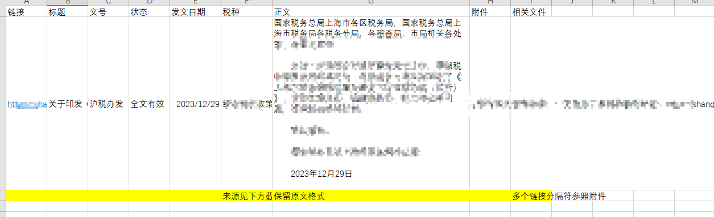

# 需求

## 采集数据格式

```json
{
  "link": "",
  "title": "",
  "editor": "",
  "state": "",
  "date": "",
  "tax_type": "",
  "text": "",
  "appendix": "",
  "related_documents": ""
}
```

- link 链接
- title 标题
- editor 文号
- state 状态
- issue date 发文日期
- tax type 税种
- text 正文
- appendix 附件（链接下载） 注：多个链接时使用 ` /` 分号分割
- related documents 相关文件（链接） 注：多个链接时使用 ` /` 分号分割




## 页面数据示例

### 内蒙古

```json
{
    "msg": "success",
    "status": 0,
    "data": {
        "id": 30492,
        "name": "按税种查询",
        "parentId": 30481,
        "code": "nmg_tax_search_gj_sz",
        "pageSize": 1,
        "sort": 0,
        "count": 9128,
        "attribute": {
            "categoryId": "",
            "title": "",
            "keywords": "",
            "description": "",
            "extend": {
                "withChild": "false",
                "faguiType": "1",
                "modelId": "fagui",
                "level": "1",
                "withParent": "false",
                "tagIds": "996423",
                "aggTagIds": "996423",
                "withText": "false"
            }
        },
        "contents": [
            {
                "id": "7185821459439161344",
                "author": "工业和信息化部",
                "categoryId": 3609,
                "clicks": 20,
                "description": "根据《中华人民共和国行政许可法》、《国务院对确需保留的行政审批项目设定行政许可的决定》、《财政部 税务总局 工业和信息化部 交通运输部关于节能 \n新能源车船享受车船税优惠政策的通知》(财税〔2018〕74号)、《工业和信息化部 财政部 国家税务总局关于调整享受车船税优惠的节能 \n新能源汽车产品技术要",
                "dictionaryValues": "None",
                "editor": "中华人民共和国工业和信息化部公告2024年第5号",
                "expiryDate": "None",
                "createDate": "None",
                "hasFiles": "False",
                "hasImages": "False",
                "hasProducts": "False",
                "modelId": "fagui",
                "onlyUrl": "None",
                "parentId": "None",
                "publishDate": "2024-04-15",
                "quoteContentId": "None",
                "siteId": "90",
                "tagIds": "None",
                "text": "None",
                "textHtml": "None",
                "title": "《道路机动车辆生产企业及产品》（第381批）、《享受车船税减免优惠的节约能源 使用新能源汽车车型目录》（第六十批）、《减免车辆购置税的新能源汽车车型目录》（第四批）",
                "url": "None",
                "cover": "None",
                "source": "None",
                "sourceUrl": "https://www.miit.gov.cn/zwgk/zcwj/wjfb/gg/art/2024/art_5e5407eaa8a74ec89101e7501cdbf77f.html",
                "extend": {
                    "sx_date_date": "2024-04-15",
                    "state_dictionary": "1",
                    "type_dictionary": "1"
                },
                "sort": 0,
                "attribute": {}
            },
            {
                "id": "7183270213901619200",
                "author": "财政部 海关总署 税务总局",
                "categoryId": 3609,
                "clicks": 22,
                "description": "内蒙古、辽宁、吉林、黑龙江、广西、云南、西藏、新疆等省(自治区)财政厅，新疆生产建设兵团财政局，国家税务总局内蒙古、辽宁、吉林、黑龙江、广西、云南、西藏、新疆等省(自治区)税务局，呼和浩特、满洲里、大连、长春、哈尔滨、南宁、昆明、拉萨、乌鲁木齐海关：为完善边境贸易支持政策，优化边民互市贸易多元化发展",
                "dictionaryValues": "None",
                "editor": "财关税〔2024〕7号",
                "expiryDate": "None",
                "createDate": "None",
                "hasFiles": "False",
                "hasImages": "False",
                "hasProducts": "False",
                "modelId": "fagui",
                "onlyUrl": "None",
                "parentId": "None",
                "publishDate": "2024-04-08",
                "quoteContentId": "None",
                "siteId": "90",
                "tagIds": "None",
                "text": "None",
                "textHtml": "None",
                "title": "财政部 海关总署 税务总局关于边民互市贸易进出口商品不予免税清单的通知",
                "url": "None",
                "cover": "None",
                "source": "None",
                "sourceUrl": "http://gss.mof.gov.cn/gzdt/zhengcefabu/202404/t20240408_3932404.htm",
                "extend": {
                    "sx_date_date": "2024-04-08",
                    "state_dictionary": "1",
                    "type_dictionary": "1"
                },
                "sort": 0,
                "attribute": {}
            }
        ],
        "tags": [
            {
                "id": 6529064,
                "name": "关税",
                "searchCount": 950,
                "sort": 5,
                "path": "6529064",
                "children": "None"
            },
            {
                "id": 6528788,
                "name": "车船税",
                "searchCount": 154,
                "sort": 10,
                "path": "6528788",
                "children": "None"
            },
            {
                "id": 6491696,
                "name": "船舶吨税",
                "searchCount": 34,
                "sort": 16,
                "path": "6491696",
                "children": "None"
            },
            {
                "id": 5718751,
                "name": "代征规费",
                "searchCount": 88,
                "sort": 20,
                "path": "5718751",
                "children": "None"
            },
            {
                "id": 5718749,
                "name": "税收征管",
                "searchCount": 496,
                "sort": 25,
                "path": "5718749",
                "children": "None"
            },
            {
                "id": 996422,
                "name": "进出口税收",
                "searchCount": 1762,
                "sort": 30,
                "path": "996422",
                "children": "None"
            },
            {
                "id": 996421,
                "name": "城市维护建设税",
                "searchCount": 196,
                "sort": 35,
                "path": "996421",
                "children": "None"
            },
            {
                "id": 996420,
                "name": "城镇土地使用税",
                "searchCount": 282,
                "sort": 40,
                "path": "996420",
                "children": "None"
            },
            {
                "id": 996419,
                "name": "环境保护税",
                "searchCount": 16,
                "sort": 45,
                "path": "996419",
                "children": "None"
            },
            {
                "id": 996418,
                "name": "土地增值税",
                "searchCount": 108,
                "sort": 50,
                "path": "996418",
                "children": "None"
            },
            {
                "id": 996417,
                "name": "耕地占用税",
                "searchCount": 151,
                "sort": 55,
                "path": "996417",
                "children": "None"
            },
            {
                "id": 996416,
                "name": "烟叶税",
                "searchCount": 10,
                "sort": 60,
                "path": "996416",
                "children": "None"
            },
            {
                "id": 996415,
                "name": "车船使用税",
                "searchCount": 164,
                "sort": 65,
                "path": "996415",
                "children": "None"
            },
            {
                "id": 996414,
                "name": "车辆购置税",
                "searchCount": 320,
                "sort": 70,
                "path": "996414",
                "children": "None"
            },
            {
                "id": 996413,
                "name": "印花税",
                "searchCount": 371,
                "sort": 75,
                "path": "996413",
                "children": "None"
            },
            {
                "id": 996412,
                "name": "资源税",
                "searchCount": 170,
                "sort": 80,
                "path": "996412",
                "children": "None"
            },
            {
                "id": 996411,
                "name": "房产税",
                "searchCount": 227,
                "sort": 85,
                "path": "996411",
                "children": "None"
            },
            {
                "id": 996410,
                "name": "契税",
                "searchCount": 242,
                "sort": 90,
                "path": "996410",
                "children": "None"
            },
            {
                "id": 996409,
                "name": "消费税",
                "searchCount": 674,
                "sort": 93,
                "path": "996409",
                "children": "None"
            },
            {
                "id": 996408,
                "name": "个人所得税",
                "searchCount": 818,
                "sort": 96,
                "path": "996408",
                "children": "None"
            },
            {
                "id": 996407,
                "name": "企业所得税",
                "searchCount": 2632,
                "sort": 99,
                "path": "996407",
                "children": "None"
            },
            {
                "id": 996406,
                "name": "增值税",
                "searchCount": 2707,
                "sort": 100,
                "path": "996406",
                "children": "None"
            }
        ]
    }
}
```
